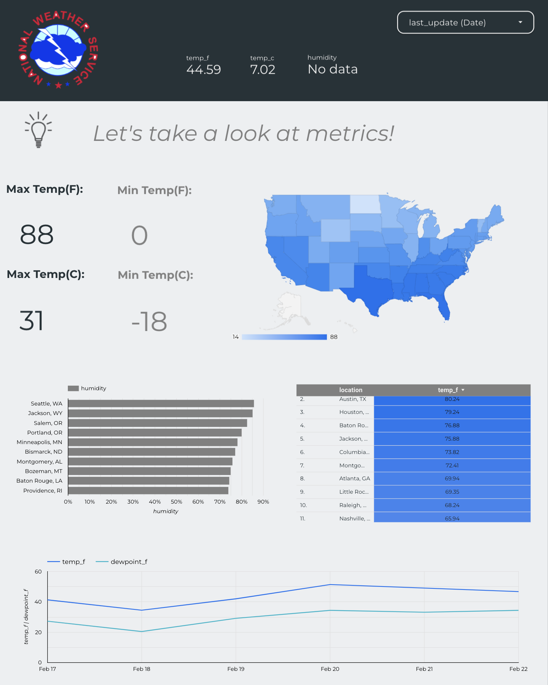
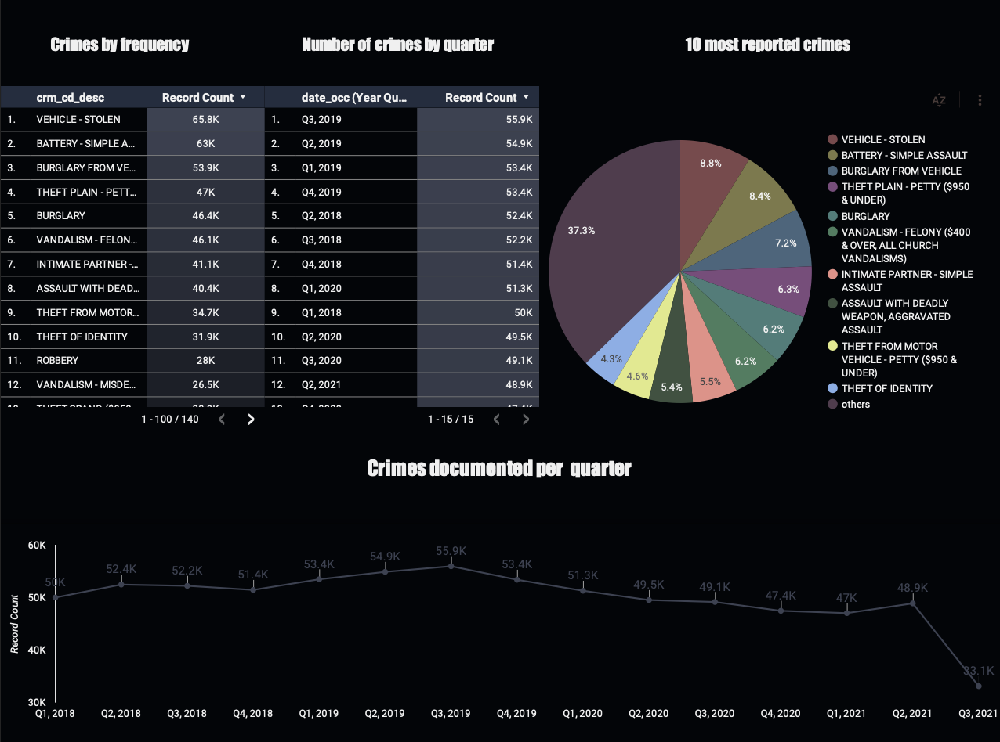
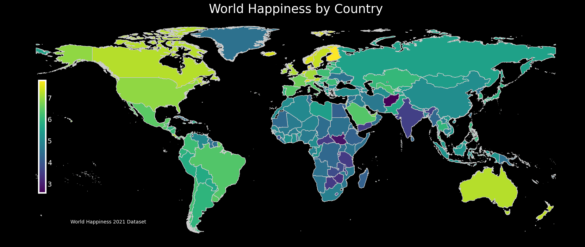

## Hi there! My name is Drew! 👋

- 🔭 I'm a Data Engineer with experience in various technologies and a diverse career background. I love to learn and I'm always exploring new areas of the industry!
- 📫 Feel free to reach me at: [d.white0002@gmail.com](mailto:d.white0002@gmail.com)
- ⚡ Fun fact: Besides spending time with my family, in my free time, I enjoy doing Danzan Ryu Ju Jitsu as well as recording my own music. I also have a diverse career history and own my own barber shop. I still periodically cut hair on the side! 

#### Check out my portfolio website for a more curated look at my projects: <a href="https://drewrwhite.com">drewrwhite.com</a>

## Technologies:

&nbsp;
&nbsp;
&nbsp;
&nbsp;
&nbsp;
&nbsp;
&nbsp;
&nbsp;
&nbsp;
&nbsp;
&nbsp; 
&nbsp; 
&nbsp; 
&nbsp;
&nbsp; 
&nbsp;
&nbsp;
&nbsp;
&nbsp;
&nbsp;

## Projects:

[Weather Database](#weather-database) | [Los Angeles Crime Analysis](#los-angeles-crime-analysis) | [Quality of Life](#quality-of-life) | [Dice Roller](#dice-roller) | [Airline ETL](#airline-etl)

## [_Weather Database_](https://github.com/Drewrwhite/weather_database)

A project that scrapes the National Weather Service website daily, makes data transformations, stores the data and creates a historical database over time.

## [_Los Angeles Crime Analysis_](https://github.com/Drewrwhite/la_crime_analysis)

- A project that processes major city crime data in the United States and generates visualizations through charts and maps.

## [_Quality of Life_](https://github.com/Drewrwhite/quality_of_life)

- A project that analyzes global quality of life data and generates visualizations through charts and maps.

## [_Dice Roller_](https://github.com/Drewrwhite/roll_dice)

- A fun Python dice roller application that uses ASCII diagrams for visualizations. Deployed to web for user interactivity with Flask.

## [_Airline ETL_](https://github.com/Drewrwhite/data_week_8)

- A Project demonstrating the use of data modeling prior to processing data with ETL pipeline.

